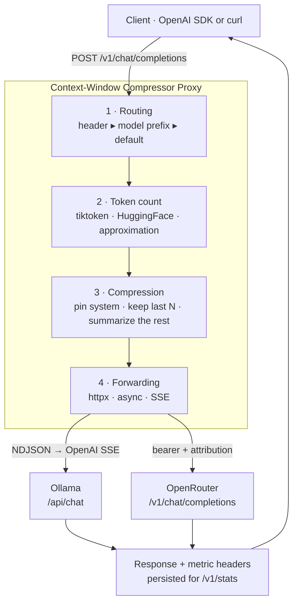
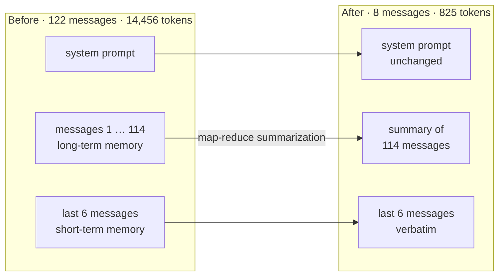
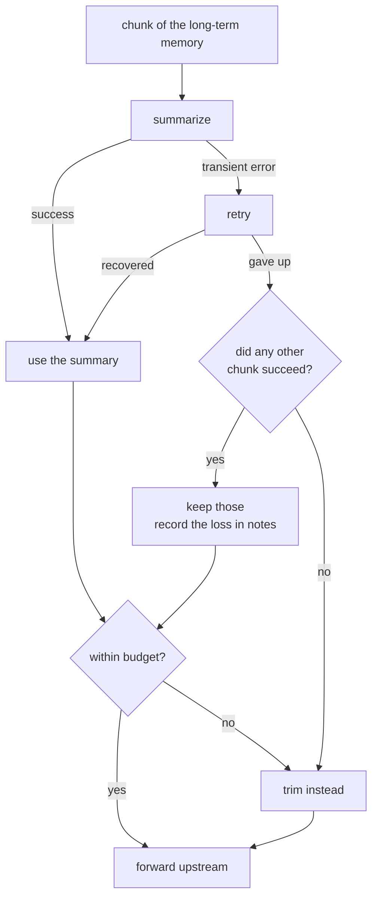

<div align="center">

# Context-Window Compressor & Local LLM Proxy

**An OpenAI-compatible proxy that keeps long conversations inside the context window — and tells you exactly what it saved.**

[](https://www.python.org/)
[](https://fastapi.tiangolo.com/)
[](#development)
[](https://mypy-lang.org/)
[](https://docs.astral.sh/ruff/)
[](LICENSE)

[](https://github.com/aprooritech/ctx-compressor/actions/workflows/ci.yml)

</div>

---

Long conversations blow past the context window and waste tokens on history the
model barely needs. Naive truncation throws away facts. This proxy sits between
your client and two LLM backends — **Ollama** locally and **OpenRouter** in the
cloud — counts every prompt, keeps the system prompt and the recent turns
verbatim, condenses everything older into dense notes, and reports the savings
in the response headers. Your client code does not change a single line.



## Contents

[Features](#features) · [Quickstart](#quickstart) · [Usage](#usage) ·
[Provider routing](#provider-routing) · [Compression](#compression) ·
[Measured results](#measured-results) · [API reference](#api-reference) ·
[Configuration](#configuration) · [Observability](#persistence--observability) ·
[Development](#development) · [Docker](#docker) · [Roadmap](#limitations--roadmap)

## Features

|  | |
|---|---|
| **Drop-in compatible** | Point any OpenAI client at `/v1`, including `stream: true` (SSE) |
| **Two backends, one API** | Ollama and OpenRouter, selected per request, with optional failover |
| **Semantic compression** | Recursive map-reduce summarization instead of blind truncation |
| **Exact token accounting** | `tiktoken`, HuggingFace tokenizers, or a conservative approximation |
| **Metrics everywhere** | `X-Saved-Ratio` and friends on every response, aggregated in SQLite |
| **Fails soft, never silently** | Typed errors, graceful degradation, a `notes` trail for every decision |

## Quickstart

```bash
python3 -m venv .venv && ./.venv/bin/pip install -e ".[dev]"
```

```bash
cp .env.example .env
```

Put your OpenRouter key into `.env` (line `OPENROUTER_API_KEY=`) if you want the
cloud backend. For a purely local setup, install [Ollama](https://ollama.com)
and pull a model instead — no key needed.

```bash
./.venv/bin/python main.py
```

The proxy listens on `http://127.0.0.1:8000`. Interactive API docs at `/docs`,
backend reachability at `/healthz`.

## Usage

<table>
<tr><td><b>OpenAI SDK</b></td><td><b>curl</b></td></tr>
<tr valign="top">
<td>

```python
from openai import OpenAI

client = OpenAI(
    base_url="http://localhost:8000/v1",
    api_key="not-needed",
)

client.chat.completions.create(
    model="ollama/llama3.1",
    messages=[...],   # arbitrarily long
    extra_headers={"X-Session-Id": "my-session"},
)
```

</td>
<td>

```bash
curl -i -X POST \
  http://localhost:8000/v1/chat/completions \
  -H 'Content-Type: application/json' \
  -d '{
    "model": "ollama/llama3.1",
    "messages": [
      {"role": "user", "content": "Hello!"}
    ]
  }'
```

</td>
</tr>
</table>

Add `"stream": true` for Server-Sent Events; the metric headers arrive before
the first chunk.

## Provider routing

| Priority | Mechanism | Example | Result |
|:---:|---|---|---|
| 1 | Header | `X-Provider: openrouter` + `model: mistral` | OpenRouter, model `mistral` |
| 2 | Model prefix | `ollama/llama3` | Ollama, model `llama3` |
| 2 | Model prefix | `openrouter/anthropic/claude-3.5-sonnet` | OpenRouter, model `anthropic/claude-3.5-sonnet` |
| 3 | Default | `llama3` | `DEFAULT_PROVIDER` |

Only the **first** path segment counts as a provider prefix, so a model id that
legitimately contains slashes (`anthropic/claude-3.5-sonnet`) survives untouched.
If header and prefix contradict each other, the proxy answers `400` instead of
silently doing the wrong thing.

With `ENABLE_PROVIDER_FALLBACK=true` an unreachable backend is retried on
`FALLBACK_PROVIDER`. This works for streaming too: the first chunk is fetched
before the response starts, so failover still produces honest headers and sets
`X-Provider-Fallback: true`.

## Compression

Compression triggers once the prompt exceeds
`MAX_CONTEXT_TOKENS − RESERVE_OUTPUT_TOKENS`, and then aims for
`trigger × COMPRESSION_TARGET_RATIO`.



| Strategy | Behaviour |
|---|---|
| `none` | Pass through |
| `trim` | Cap and drop old messages |
| `summarize` | Map-reduce summarization of the long-term memory |
| `hybrid` *(default)* | Summarize first, then trim if still too large |

**Guaranteed invariants**, each covered by tests:

1. `system`/`developer` messages are never dropped and stay in front.
2. The last `KEEP_LAST_MESSAGES` messages stay verbatim; the newest message
   always survives, even with `KEEP_LAST_MESSAGES=0`.
3. A `tool` result is never separated from the assistant message that called it.
4. Compression **never raises**. If the summarizer fails, the engine degrades to
   trimming and records the reason in `CompressionResult.notes`.
5. A single failed chunk costs detail, not the whole summary.

That last point is what keeps the proxy usable on flaky or rate-limited
backends:



By default the **same model** that serves the request also writes the summary, so
local setups stay fully offline. `SUMMARY_PROVIDER`/`SUMMARY_MODEL` decouple that
— for example, summarize with a cheap local model while a cloud model answers.

## Measured results

Verified against the live OpenRouter API with the free model
`nvidia/nemotron-3-ultra-550b-a55b:free`, tokenizer `tiktoken:cl100k_base`:

```
122 messages, filler text
  before  ████████████████████████████████████████  14,456 tokens · 122 msg
  after   ██▌                                            825 tokens ·   8 msg   −94.3 %

94 messages, needle test
  before  ████████████████████████████████████████   9,327 tokens ·  94 msg
  after   ████                                          967 tokens ·   8 msg   −89.6 %
```

The needle-in-a-haystack test is the real proof. A unique fact is planted at the
very start of the conversation — *emergency rollback code `ZEBRA-7719`, owner
Mira Kowalski, extension 4412*. After compression that information exists **only
in the generated summary**; the original message is gone. Asked at the end, the
model answered:

> **Notfall-Rollback-Code:** ZEBRA-7719
> **Verantwortlich:** Mira Kowalski (Durchwahl 4412)

So the engine does not merely count tokens, it carries the content. Reproduce it
against your own backend:

```bash
./.venv/bin/python scripts/live_check.py openrouter/<model>
```

<details>
<summary>What actually arrives at the backend</summary>

```
[system   ] You are a DevOps assistant. Answer concisely.
[system   ] [compressed context] Condensed notes covering 86 earlier messages ...
[user     ] Round 43: How did we implement the monitoring alerts? ...
[assistant] Round 43: We rolled the monitoring alerts out behind a feature flag ...
[user     ] Final question: what is our emergency rollback code ...
```

</details>

> [!NOTE]
> Summarization costs extra LLM calls. With the free model above, compression
> took 32 s (3 chunks at ~10 s each); with a local Ollama model or a fast cloud
> model it is a matter of seconds. `SUMMARY_CHUNK_TOKENS` directly controls how
> many calls are made.

## API reference

| Method | Path | Purpose |
|---|---|---|
| `POST` | `/v1/chat/completions` | OpenAI-compatible, incl. `stream: true` (SSE) |
| `GET` | `/v1/models` | Aggregated model catalogue of both backends |
| `GET` | `/v1/stats` | Aggregated savings (`?window_hours=24`) |
| `GET` | `/v1/stats/requests` | Recent request logs (`?limit=`, `?session_id=`) |
| `GET` | `/healthz` | Backend reachability, tokenizer, database |

### Metric headers on every response

| Header | Meaning |
|---|---|
| `X-Original-Tokens` · `X-Compressed-Tokens` | Tokens before and after |
| `X-Saved-Tokens` · `X-Saved-Ratio` | Absolute and relative savings |
| `X-Compression-Strategy` | `none`, `trim`, `summarize`, `summarize+trim` |
| `X-Compression-Budget` · `X-Compression-Ms` | Target budget and time spent |
| `X-Messages-In` · `X-Messages-Out` | Message count before and after |
| `X-Provider` · `X-Model` · `X-Route-Source` | Backend actually used |
| `X-Session-Id` · `X-Tokenizer` · `X-Upstream-Ms` | Session, tokenizer, backend latency |

All of them are listed in `Access-Control-Expose-Headers`, so browser clients can
read them too.

<details>
<summary>Error semantics</summary>

| Status | Meaning |
|:---:|---|
| `400` | Routing conflict between header and model prefix |
| `401` | Missing or invalid proxy API key |
| `422` | Request body failed schema validation |
| `500` | Missing configuration, e.g. no OpenRouter key |
| `502` | Backend answered with an error |
| `503` | Backend unreachable |
| `504` | Backend timed out |

Every response follows the OpenAI error schema and carries the upstream body for
diagnosis.

</details>

## Configuration

Every knob is documented in [`.env.example`](.env.example). The ones that matter
most:

| Variable | Default | Purpose |
|---|---|---|
| `DEFAULT_PROVIDER` | `ollama` | Backend without header or prefix |
| `OLLAMA_HOST` | `http://localhost:11434` | Ollama daemon |
| `OPENROUTER_API_KEY` | – | Bearer token, required for OpenRouter |
| `MAX_CONTEXT_TOKENS` | `8192` | Hard prompt budget |
| `RESERVE_OUTPUT_TOKENS` | `1024` | Reserved for the completion |
| `COMPRESSION_TARGET_RATIO` | `0.6` | Target size after compression |
| `KEEP_LAST_MESSAGES` | `6` | Short-term memory |
| `COMPRESSION_STRATEGY` | `hybrid` | `none` · `trim` · `summarize` · `hybrid` |
| `SUMMARY_CHUNK_TOKENS` | `1500` | Chunk size = number of summarizer calls |
| `SUMMARY_RETRY_ATTEMPTS` | `2` | Retries per chunk on rate limits |
| `TOKENIZER_BACKEND` | `tiktoken` | `tiktoken` · `huggingface` · `approx` |
| `TOKENIZER_INIT_TIMEOUT_SECONDS` | `10.0` | Deadline for the vocabulary download |
| `PROXY_API_KEYS` | – | Optional auth on the proxy itself |
| `ENABLE_PROVIDER_FALLBACK` | `false` | Failover on backend outage |

## Persistence & observability

`aiosqlite` in **WAL mode** (`journal_mode=WAL`, `synchronous=NORMAL`), a single
shared connection, writes serialized through an `asyncio.Lock`, and schema
migrations tracked via `PRAGMA user_version`.

- **`sessions`** — session id, first and last contact, request count
- **`request_logs`** — provider, model, strategy, tokens before/after, latencies
  (total, upstream, compression), status and error type

Metric write failures are logged but **never** break a proxied request, and
message content is not stored by default (`PERSIST_MESSAGE_PREVIEW=false`).

## Development

```bash
./.venv/bin/python -m pytest -q
```

```bash
./.venv/bin/mypy src scripts main.py && ./.venv/bin/ruff check src tests scripts main.py
```

- **61 tests** — tokenizer, compression logic, routing, provider translation
  (HTTP-mocked with `respx`) and end-to-end over ASGI including the lifespan.
- **mypy `strict`** clean, **ruff** clean.
- **Live smoke test** against a real backend, including the needle test:

```bash
./.venv/bin/python scripts/live_check.py openrouter/google/gemma-4-31b-it:free
```

A `pre-commit` hook refuses to commit `.env` or anything that looks like an API
key. Enable it once per clone:

```bash
git config core.hooksPath .githooks
```

## Docker

```bash
cp .env.example .env && docker compose up --build
```

The image runs as a non-root user (uid 10001), ships a `HEALTHCHECK`, and bakes
the `cl100k_base` vocabulary in at build time — so the container never needs to
reach the tiktoken CDN at startup. Metrics live in the named volume `proxy-data`.
Uncomment the `ollama` service in [`docker-compose.yml`](docker-compose.yml) to
run a local model alongside the proxy.

> [!WARNING]
> The Docker setup has been reviewed but not executed — no Docker daemon was
> available in the environment this project was built in.

## Project layout

<details>
<summary>Directory tree</summary>

```
.
├── main.py                     # Entry point (uvicorn main:app)
├── pyproject.toml              # Deps, pytest, mypy and ruff configuration
├── .env.example                # Complete configuration template
├── Dockerfile / docker-compose.yml
├── src/
│   ├── config.py               # pydantic-settings: every tunable
│   ├── schemas.py              # OpenAI-compatible Pydantic v2 models
│   ├── errors.py               # Typed errors + OpenAI error handlers
│   ├── routing.py              # Provider resolution
│   ├── app.py                  # App factory, lifespan, CORS, /healthz
│   ├── api/
│   │   ├── deps.py             # AppState, auth, compressor construction
│   │   ├── chat.py             # POST /v1/chat/completions, GET /v1/models
│   │   └── stats.py            # GET /v1/stats, /v1/stats/requests
│   ├── compressor/
│   │   ├── tokenizer.py        # tiktoken / HF / approximation + truncation
│   │   ├── summarizer.py       # LLM-backed summarization
│   │   └── engine.py           # Compression strategy (core)
│   ├── providers/
│   │   ├── base.py             # ABC + HTTP error translation
│   │   ├── ollama.py           # Native Ollama API ⇄ OpenAI
│   │   ├── openrouter.py       # OpenRouter (bearer, attribution)
│   │   └── registry.py         # Adapter registry
│   └── db/
│       ├── database.py         # aiosqlite, WAL, migrations
│       └── repository.py       # Metric persistence + aggregation
├── scripts/live_check.py       # Smoke test against a real backend
└── tests/                      # 61 pytest tests
```

</details>

## Limitations & roadmap

- **No summary cache.** Identical histories are summarized again on every
  request. A per-session cache is the obvious next step.
- **SQLite is single-process.** For multiple workers either set `DB_ENABLED=false`
  or switch to Postgres — `MetricsRepository` is the only place to touch.
- **Summarization costs tokens.** Watch `summary_calls` in the database; with
  cloud models, `SUMMARY_PROVIDER=ollama` keeps that cost local.
- **Free OpenRouter models** share upstream pools, frequently answer `429`, and
  some return empty `content`. Prefer a paid model or local Ollama in production.
- **Startup without network.** `tiktoken` downloads its vocabulary on first use.
  If the CDN is blocked, the approximation takes over after
  `TOKENIZER_INIT_TIMEOUT_SECONDS` and the proxy still starts — `X-Tokenizer`
  always tells you which backend is active.

---

<div align="center">

[MIT](LICENSE) © 2026 aprooritech

</div>
